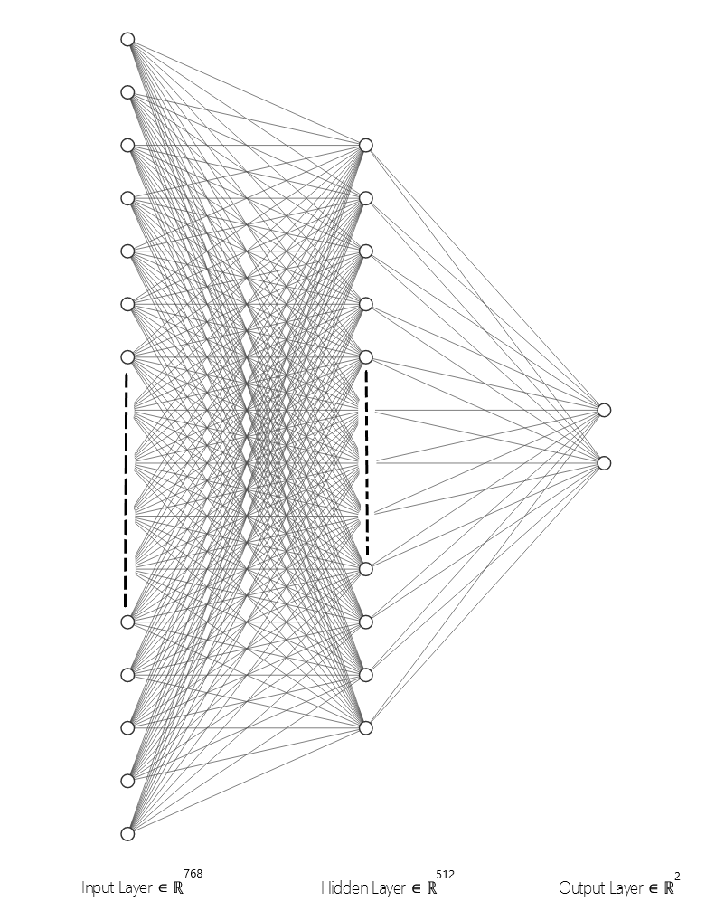

# Fine Tuning HuggingFace-Transformers

This folder contains notebooks to Finetune HuggingFace implementations of BERT and RoBerta. The weights of the models were frozen then two Neural Layers were attached to the same before training.

Both the models were trained for 25 epochs with 100% of Collected Data and 20% of [WinoGrande dataset](https://winogrande.allenai.org/). The models were tested on the rest 80% of WinoGrande dataset.

The architecture of the attached Neural Network attached is shown below.

Idea inspired from [Transfer Learning for NLP: Fine-Tuning BERT for Text Classification](https://www.analyticsvidhya.com/blog/2020/07/transfer-learning-for-nlp-fine-tuning-bert-for-text-classification/)
